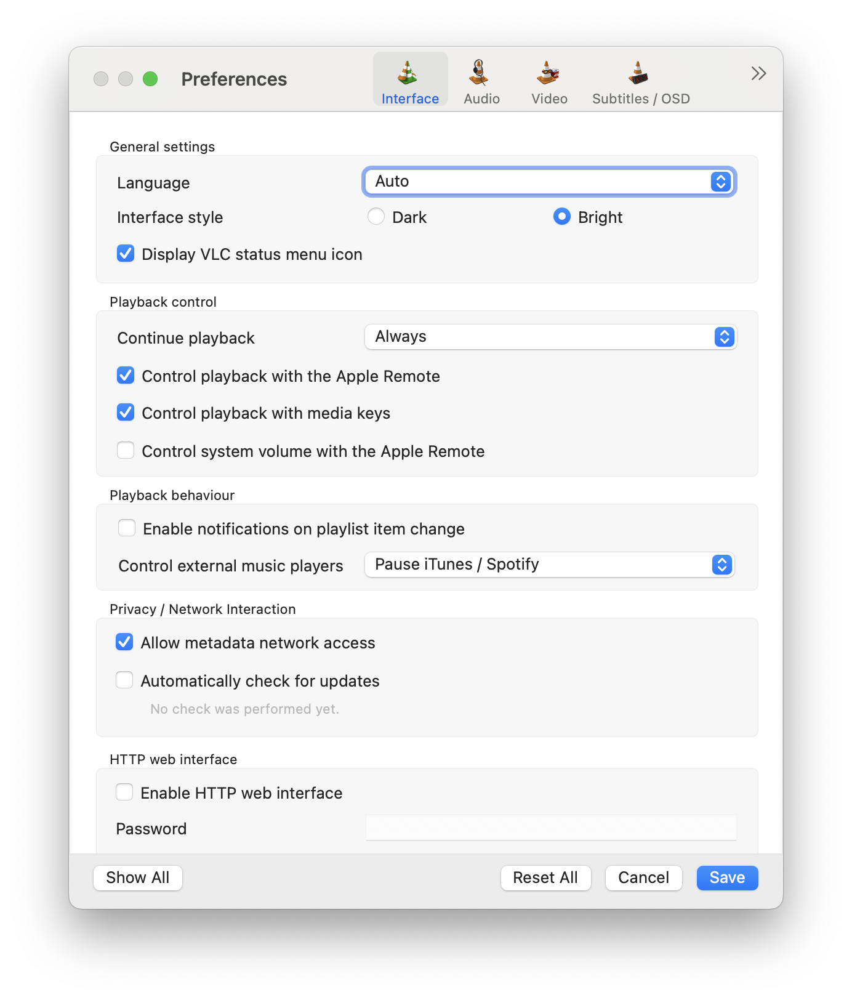
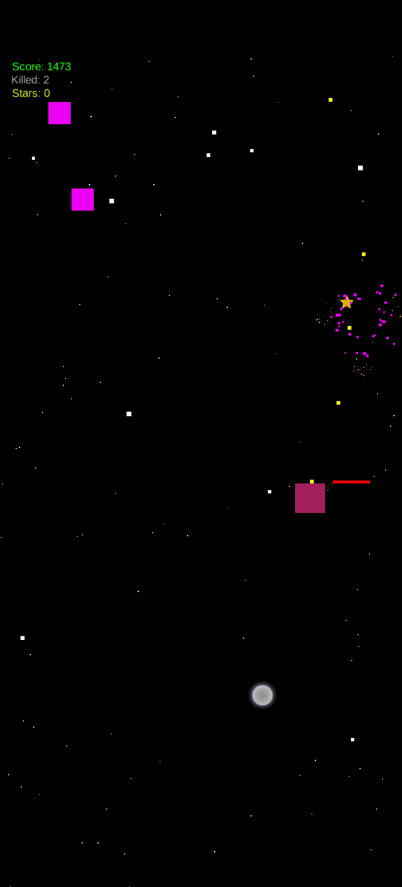
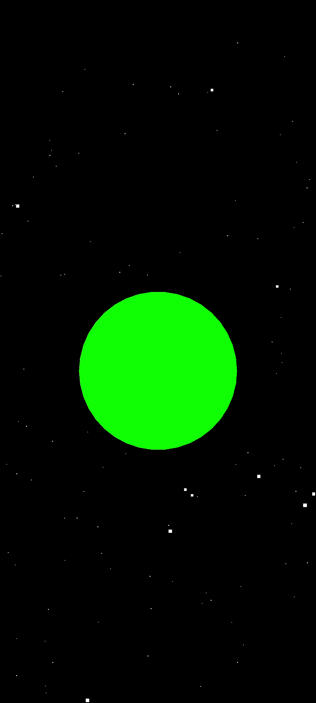
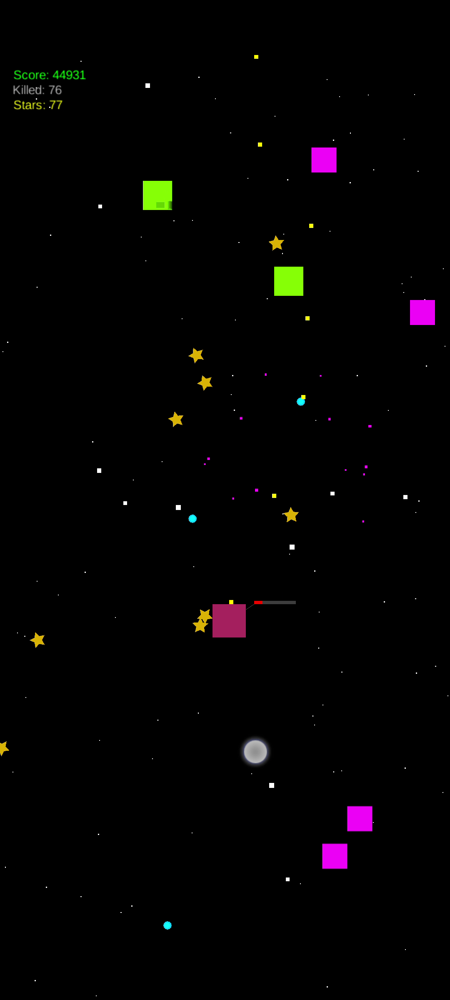
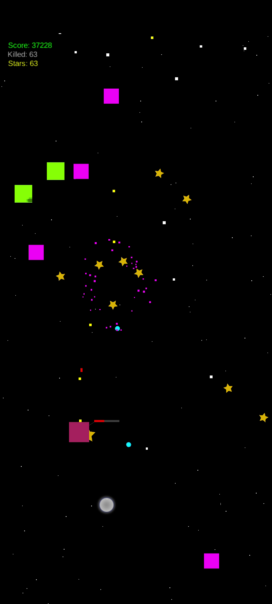
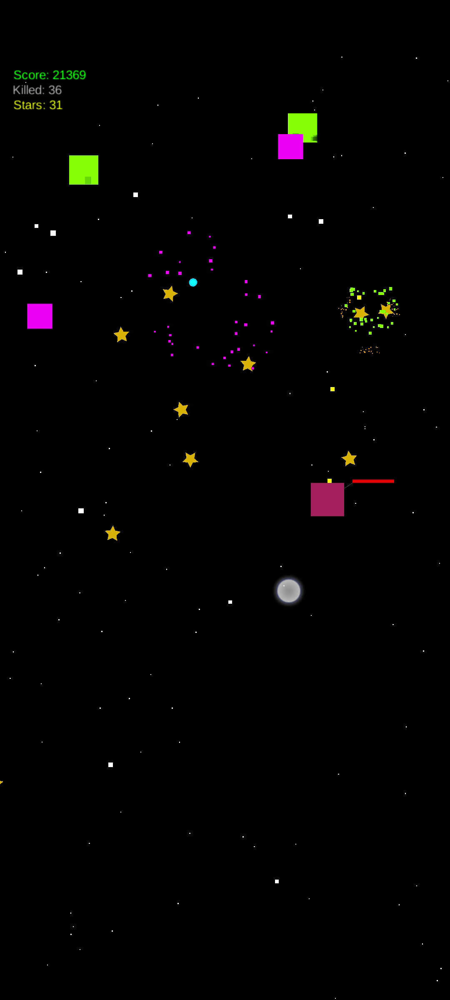
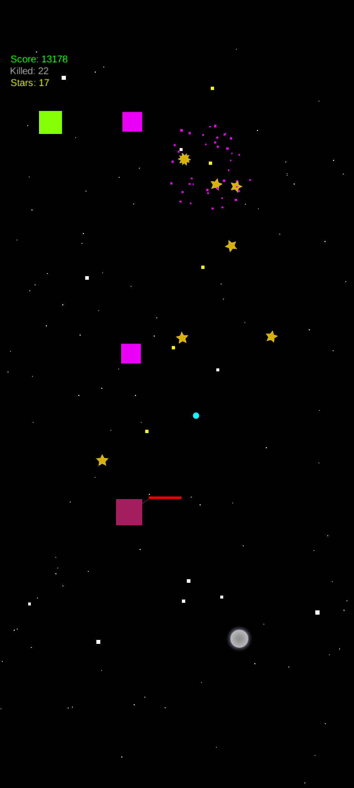

# Space Shooter

A modern, polished **vertical-scrolling arcade space shooter** for Android & iOS, built with
[LibGDX](https://libgdx.com/). You pilot a neon fighter, fight waves of increasingly varied alien
ships, collect stars/currency, upgrade weapons, and take down bosses.

> Inspired by classic mobile shooters such as Sky Force.

---

## Install Android app

- [Download and install the Android APK](space-shooter-debug.apk)
- Or clone the repo and build from source:

```
./gradlew :android:assembleDebug
```

The resulting APK is written to `android/build/outputs/apk/debug/android-debug.apk`.

## Install iOS app

- Clone the repo and build from source.
- > There's a known bug preventing the iOS build from running on the simulator for some Xcode versions.

## Desktop / Web

- Although LibGDX supports desktop & web targets, this project intentionally targets mobile only.

## Requirements

- **Android Studio** — building & running the Android app
- **Xcode** — building & running the iOS app
- **MobiVM plugin** for Android Studio — AOT compiler for Java → iOS

---

# Game Features

## Controls

- **Drag** anywhere on the screen to move the ship
- **Hold** the screen to shoot continuously

## Weapons (3 tracks, single shared level 1→7)

| Track | Style | Max shots | Identity |
|-------|-------|-----------|----------|
| **Laser** | Neon blue beam fan | 5 beams | Fast, spread, low per-hit damage |
| **Blast** | Neon orange orbs (pierce) | 3 orbs | Pierces through enemies |
| **Homing** | Neon purple darts | 3 darts | Auto-tracks the nearest enemy |

- Eating a **weapon-switch** item changes your active track (eating the SAME track also +1 level).
- Eating a **power-up (energy)** item raises your weapon level without switching tracks.
- At boss waves (5/10/15/20) a pity drop guarantees an energy + weapon item if you're under Lv5.

## Enemies (6 types + boss)

Every enemy has a distinct silhouette, fire pattern, HP, and speed:

- **EnemyShipA** — basic grunt, slow red orb
- **EnemyShipB** — elite gunner, homing green orb
- **EnemyShipC** — sniper, aimed hot-pink orb
- **EnemyShipD** — tank, 3-way gold spread
- **EnemyShipE** — fast striker, twin purple pulses
- **EnemyShipF** — heavy dragoon, 4-way ring burst
- **Boss (Dreadnought)** — huge, 3 weapons: plasma fan + fast volley + aimed plasma sniper

## Items

- **Star** (gold) — currency; magnetizes toward you
- **HP** (red cross) — heals +1 (only magnetizes when very close)
- **Weapon switch** (blue bolt / orange burst / purple crosshair) — change active track
- **Energy** (green cell) — raise weapon level

## Waves

- Data-driven from `assets/data/waves.json` (20 waves + endless loop).
- Wave 1–5 is a showcase progression: one new enemy per wave, boss climax at Wave 5.
- Enemy HP scales exponentially per wave/loop.

## Visuals & Feedback

- Real neon sprites (ships, projectiles, items), dark nebula space background.
- Muzzle flashes, layered explosions, hit sparks, screen shake, damage decals.
- Clean neon HUD: HP (red) + weapon left, WAVE top-center, star + score right, pause top-right.

## Audio

- Original synthesized soundtrack + distinct SFX for firing, hits, explosions, pickups,
  power-ups, boss warnings, wave start/clear — see `assets/ATTRIBUTIONS.md`.

---

# Credits

- **Author / Developer:** [Nguyễn Văn Rin](mailto:nrin31266@gmail.com) (Rin Nguyen)
- Original prototype & engine work; this repository has been progressively modernized into a
  polished neon arcade shooter (visuals, audio, assets, HUD, wave design, combat feedback).

All sprites, music and identity SFX are original/synthesized assets generated by the scripts in
`tools/` (see `assets/ATTRIBUTIONS.md` for full details).

---

# Building / Recording gameplay

## Record Android screen (Android 11+)

Use the system **Screen Record** in the quick-settings tray (enable *screen touches* if desired).

## Extract frames from video with VLC

Install VLC → Settings → `Show All` → `Video → Filters` → `Scene filter` → set prefix/output dir
and a recording ratio → enable the filter → play the video. Frames are extracted while playing.

[](assets/vlc/vlc-settings.png)

## Make a GIF from a set of images with ffmpeg

```
ffmpeg -framerate 12 -pattern_type glob -i '*.png' -filter_complex "[0:v]scale=640:-2,split[x][z];[x]palettegen[y];[z][y]paletteuse" output.gif
```

---

# Screenshots

[](assets/screenshots/space-shooter.gif)
[](assets/screenshots/space-shooter-01.png)
[](assets/screenshots/space-shooter-02.png)
[](assets/screenshots/space-shooter-03.png)
[](assets/screenshots/space-shooter-04.png)
[](assets/screenshots/space-shooter-05.png)

