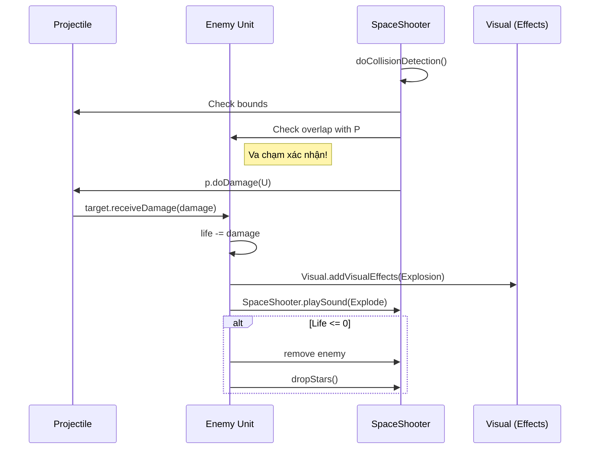

# [TÀI LIỆU CHI TIẾT] Cấu Trúc và Logic Game Space Shooter

Tài liệu này là bản phân tích toàn diện và chuyên sâu về dự án **Space Shooter**, một trò chơi bắn súng không gian 2D được xây dựng trên nền tảng **LibGDX**. Nó đào sâu vào mọi khía cạnh từ kiến trúc lớp, logic toán học, hệ thống hạt cho đến các cơ chế tương tác phức tạp.

---

## 1. Tổng Quan Kiến Trúc (Core Architecture)

Game được thiết kế theo mô hình hướng đối tượng (OOP) chặt chẽ, tận dụng tối đa tính kế thừa để quản lý hàng trăm thực thể trên màn hình một cách hiệu quả.

### 1.1. Hệ Thống Phân Cấp Lớp (Class Hierarchy)
- **`Visual.java`**: Lớp tổ tiên của mọi thứ. Nó định nghĩa các thuộc tính vật lý cơ bản: `position`, `velocity`, `size`, `color`, `direction`, `speed`. Hỗ trợ kiểm tra va chạm AABB (Axis-Aligned Bounding Box) và quản lý danh sách `static` các hiệu ứng hình ảnh toàn cục.
- **`Unit.java` (Kế thừa `Visual`)**: Bổ sung các khái niệm về "sự sống". Có `life`, `maxLife`, danh sách vũ khí (`Weapon`), và các hiệu ứng phản hồi khi bị trúng đạn (`flash`, `damagePoints`).
- **`Ship.java` (Kế thừa `Unit`)**: Đại diện cho người chơi. Tích hợp rung (`vibration`) và hệ thống cảnh báo máu thấp (`alarm`).
- **`EnemyShipA/B.java` (Kế thừa `Unit`)**: Các loại tàu địch với máu và vũ khí khác nhau.
- **`Projectile.java` (Kế thừa `Visual`)**: Quản lý đạn bay. Có khả năng tự tìm mục tiêu (`isHoming`).
- **`Item.java` & `ItemStar.java`**: Các vật thể có thể thu thập, có logic chuyển động phức tạp (văng ra khi nổ và bị hút bởi nam châm).

---

## 2. Phân Tích Logic Chuyên Sâu Theo Từng Module

### 2.1. Lớp Nền Tảng: `Visual.java`
Đây là "xương sống" của hệ thống rendering.
- **Tọa độ & Vận tốc**: Sử dụng `Vector2` để quản lý vị trí và vận tốc. Vận tốc được tính toán dựa trên `direction` (góc) và `speed` (tốc độ).
- **Cơ chế Update**: Phương thức `updatePosition(deltaTime)` đảm bảo chuyển động mượt mà bằng cách nhân vận tốc với `scale` (tỉ lệ giữa `deltaTime` hiện tại và FPS mục tiêu). Điều này giúp game không bị chạy nhanh/chậm bất thường khi FPS trồi sụt.
- **Va chạm**: Hàm `isColliding(Visual)` thực hiện kiểm tra AABB đơn giản: nếu hai hình chữ nhật bao quanh thực thể giao nhau, va chạm được xác nhận.

### 2.2. Hệ Thống Chiến Đấu & Vũ Khí (`Weapon` & `Projectile`)
Hệ thống này tách biệt hoàn toàn giữa việc *bắn* và viên đạn *bay*.
- **`Weapon.java`**: Sử dụng một `Timer` nội bộ để điều khiển `fireRate`. Khi bắn, nó trả về một mảng `Projectile`.
- **Logic Đạn Tầm Nhiệt (`ProjectileRocket.java`)**:
    - Sử dụng hàm `MathUtils.atan2` để tính góc từ viên đạn đến tàu người chơi/kẻ địch.
    - **Smoothing Rotation**: Thay vì quay ngay lập tức về phía mục tiêu, nó sử dụng `angularSpeed` để quay từ từ mỗi frame, tạo cảm giác tên lửa đang lượn vòng.
    - **Target Acquisition**: Nếu mục tiêu hiện tại chết, tên lửa sẽ gọi `SpaceShooter.acquireTarget()` để tìm kẻ địch mới từ danh sách `enemies`.
- **Vũ khí đặc biệt (`WeaponEnergyBallA`)**: Sử dụng một lớp nặc danh (anonymous class) để ghi đè phương thức `render`, vẽ các vòng tròn lồng nhau bằng `ShapeRenderer` thay vì dùng texture, tạo hiệu ứng cầu năng lượng phát sáng.

### 2.3. Hệ Thống Hạt & Hiệu Ứng (Particle System)
Dự án tự xây dựng một engine hạt mini cực kỳ linh hoạt thay vì dùng `ParticleEmitter` mặc định của LibGDX.
- **`ParticleEmitter.java`**: Quản lý vòng đời phát xạ.
    - **Emission Cycle**: Có thể cấu hình số lượng đợt phát (`emissionCycles`), độ trễ giữa các hạt (`emissionEventDelay`) và số lượng hạt mỗi lần (`emissionAmountPerEvent`).
    - **Randomization**: Mọi thuộc tính của hạt (kích thước, tốc độ, góc, tuổi thọ) đều có biến `variation` để tạo sự tự nhiên.
- **Các loại hiệu ứng cụ thể**:
    - `EffectExplosion`: Tạo ra 40 hạt văng ra mọi hướng (360 độ).
    - `EffectSparks`: Tạo ra các tia lửa nhỏ, thường được bắn ra theo hướng ngược lại với hướng va chạm.
    - `EffectFlash`: Tạo hiệu ứng chớp sáng khi trúng đạn.

### 2.4. Logic Điều Khiển & Nhập Liệu (`SpaceShooter.java` & `TouchData`)
- **Relative Movement**: Khi người chơi chạm vào tàu và kéo, mã nguồn tính toán `touchDisplacement`. Tàu không nhảy đến vị trí ngón tay mà di chuyển *theo* ngón tay. Điều này cực kỳ quan trọng vì nó giúp tàu không bị che khuất bởi ngón tay người chơi.
- **Slow-motion (Matrix Effect)**:
    ```java
    if (!screenTouched) {
        gameSpeed -= gameSpeedDelta; // Giảm tốc độ xuống SLOW_MO_GAME_SPEED_LIMIT (0.2f)
    }
    ```
    Toàn bộ logic `deltaTime` trong game đều được nhân với `gameSpeed`. Khi bạn bỏ tay ra, game chậm lại 5 lần, cho phép người chơi thực hiện các pha né đạn "thần thánh".

---

## 3. Quản Lý Tài Nguyên & Đồ Họa

### 3.1. Kỹ Thuật Vẽ Phức Tạp (`ItemStar.java`)
Ngôi sao trong game không phải là ảnh PNG. Nó được vẽ bằng toán học:
- **`EarClippingTriangulator`**: Sử dụng thuật toán này để chia một đa giác hình sao phức tạp thành các tam giác nhỏ để `ShapeDrawer` có thể vẽ mượt mà.
- **Toán học hình sao**: Hàm `createStarPolygons` tính toán các đỉnh dựa trên `arms` (số cánh), `rOuter` (bán kính ngoài) và `rInner` (bán kính trong).

### 3.2. Background Parallax (`Starfield.java`)
- Game sử dụng **2 lớp Starfield** chồng lên nhau.
- Lớp 1: Sao nhỏ, nhiều, chạy chậm (`STAR_SCROLL_SPEED = 50`).
- Lớp 2: Sao lớn, ít, chạy nhanh hơn (`STAR_SCROLL_SPEED_2 = 100`).
- **Object Pooling (Tái sử dụng)**: Khi một ngôi sao trôi ra khỏi cạnh dưới, nó không bị xóa. Thay vào đó, nó được đặt lại (`setY`) lên phía trên màn hình với vị trí X ngẫu nhiên. Điều này triệt tiêu hoàn toàn việc cấp phát bộ nhớ liên tục cho background.

### 3.3. Quản Lý Âm Thanh & Nhạc Nền
- **Âm thanh đa dạng**: Khi kẻ địch nổ, game không chỉ phát 1 âm thanh. Nó sử dụng `getRandomSoundName(SoundType.Explode)` để chọn ngẫu nhiên giữa `Explode2`, `Explode3`,... giúp trải nghiệm thính giác phong phú hơn.
- **Hệ thống cảnh báo**: Khi tàu người chơi còn ít máu (`isCriticalHealth`), một loop âm thanh `Alarm` sẽ được kích hoạt liên tục cho đến khi người chơi hồi máu hoặc chết.

---

## 4. Chi Tiết Logic Game Loop (`render` method)

Vòng lặp `render()` được chia thành các phase rõ rệt trong switch-case `GameMode`:

1.  **Chế độ Menu**:
    - Vẽ background và tàu ở vị trí cố định.
    - Hiển thị một vòng tròn xanh (Play button giả định).
    - Đợi tín hiệu `touchUp` từ `TouchData` để reset game và bắt đầu.

2.  **Chế độ Playing**:
    - **Update Phase**: 
        - Cập nhật vận tốc đạn, tàu địch.
        - Kiểm tra va chạm: Đạn -> Địch, Địch -> Tàu, Đạn địch -> Tàu.
        - Cập nhật điểm số qua `ScoreTracker`.
    - **Collision Detection**: 
        - Loại bỏ đạn/địch ra khỏi danh sách nếu bay khỏi vùng `BUFFER_ZONE` (30 pixel ngoài màn hình).
        - Khi va chạm xảy ra, gọi `receiveDamage` và tạo hiệu ứng `Visual.addVisualEffects`.
    - **Render Phase**: Vẽ theo thứ tự lớp để đảm bảo tính thẩm mỹ (UI luôn nằm trên cùng).

3.  **Chế độ Died**:
    - Dừng toàn bộ âm thanh và nhạc chiến đấu.
    - Hiển thị màn hình đỏ và điểm số cuối cùng.

---

## 5. Các Lớp Tiện Ích (Utility Classes)

- **`Timer.java`**: Một công cụ quản lý thời gian cực kỳ chính xác. Nó không chỉ đếm giây mà còn có cơ chế bù trừ sai số: `elapsedTime = elapsedTime - durationMillis`. Điều này giúp các hành động lặp đi lặp lại (như bắn súng) không bị trễ nhịp theo thời gian dài.
- **`ScoreTracker.java`**: Tính điểm dựa trên số kẻ địch tiêu diệt (`POINTS_PER_KILL = 500`) và cả thời gian sống sót (`POINTS_PER_TIME_TICK = 2`).
- **`Utils.java`**: Chứa các hàm chuẩn hóa góc (`normalizeAngle360`) giúp xử lý logic xoay tàu và tên lửa không bị lỗi khi góc vượt quá 360 hoặc nhỏ hơn 0.

---

## 6. Sơ Đồ Quy Trình Va Chạm (Sequence Diagram)



---

> [!IMPORTANT]
> **Điểm yếu hiện tại của kiến trúc**:
> Lớp `Ship` sử dụng một "sloppy hack" là gán thực thể tàu vào biến `static Visual ship`. Điều này giới hạn game chỉ có 1 người chơi duy nhất và tạo ra sự phụ thuộc chặt chẽ giữa các lớp khác khi muốn truy cập tọa độ tàu. Tuy nhiên, với quy mô dự án hiện tại, nó giúp truy cập dữ liệu nhanh chóng mà không cần truyền tham chiếu qua nhiều tầng lớp.

> [!WARNING]
> **Hiệu năng**: Việc vẽ các ngôi sao bằng `ShapeDrawer` và `EarClippingTriangulator` trong mỗi frame có thể gây tốn tài nguyên CPU nếu số lượng ngôi sao quá lớn. Hiện tại game đang giữ ở mức ổn định nhưng cần lưu ý khi mở rộng.

---

Tài liệu này phản ánh trạng thái hiện tại của mã nguồn vào tháng 07/2026. Mọi thay đổi về logic vũ khí hoặc cơ chế spawning nên được cập nhật vào các mục tương ứng tại đây.
